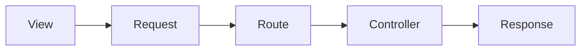

Pada dasar nya project ini dibuat dengan metode seperti berikut :



Maka untuk tracking modul, dapat dilakukan dengan memperhatikan hal-hal berikut :

## URI

Untuk mendapatkan **nama route**, bisa dengan mengecek endpoint URI dari halaman yang akan dicek.


Atau bisa juga Dengan mengecek **Network/Jaringan** untuk kasus request melalui javascript.


Atau jika terbiasa dengan **Laravel Debugbar** bisa dengan mengecek debugbar.


:::info
Jika ingin melakukan **pengecekan secara detail** yang lebih lengkap dan disertai performa, sebaiknya menggunakan **Laravel Debugbar**.
:::


## Routes

Setelah didapatkan URI-nya maka bisa langsung dicek ke folder project.


Dalam ```routes\web.php``` terdapat beberapa hal yang perlu diperhatikan:

#### Controller

Biasanya route akan dibungkus dalam satu group berdasarkan satu **Controller**. Sebagai tempat yang menampung function-function yang akan digunakan route dalam group. Untuk track lokasi file Controller yang digunakan bisa dengan mengecek langsung ke ```App\Http\Controllers\...```. Jika menggunakan **VS Code** bisa langsung ```Ctrl+P``` . Atau lebih mudah lagi bisa menggunakan extension.

#### Middleware

Setiap route group biasanya akan menggunakan **Role Middleware**. Untuk membatasi akses user. Contohnya <code>middleware('role:marker,cutting,stocker')</code> , artinya siapa saja yang punya role <code>marker</code>, <code>cutting</code>, atau <code>stocker</code> bisa mengakses rute tersebut. Kamu bisa memasukkan satu atau lebih role ke dalam <code>role:</code>. Filenya bisa dicek di ```App\Http\Middleware\RoleMiddleware.php```.

```php title='App\Http\Middlewate\RoleMiddlewate.php'
<?php

namespace App\Http\Middleware;

use Closure;
use Illuminate\Support\Facades\Auth;
use Illuminate\Http\Request;

class RoleMiddleWare
{
    /**
     * Handle an incoming request.
     *
     * @param  \Illuminate\Http\Request  $request
     * @param  \Closure(\Illuminate\Http\Request): (\Illuminate\Http\Response|\Illuminate\Http\RedirectResponse)  $next
     * @return \Illuminate\Http\Response|\Illuminate\Http\RedirectResponse
     */
    public function handle(Request $request, Closure $next, ...$roles)
    {
        $user = Auth::user();

        if (in_array("superadmin", $roles)) {
            if ($user->roles->whereIn("nama_role", ["superadmin"])->count() > 0) {
                return $next($request);
            }
        } else if (in_array("management", $roles)) {
            if ($user->roles->whereIn("nama_role", ["management"])->count() > 0) {
                return $next($request);
            }
        } else if (in_array("admin", $roles)) {
            if ($user->roles->whereIn("nama_role", ["admin", "superadmin"])->count() > 0) {
                return $next($request);
            }
        } else {
            if ((!(in_array("accounting", $roles)) || !(in_array("management", $roles))) && $user->roles->whereIn("nama_role", ["admin", "superadmin"])->count() > 0) {
                return $next($request);
            }

            foreach($roles as $role) {
                // Check if user has the role This check will depend on how your roles are set up
                foreach ($user->roles as $userRole) {
                    if ((($role == 'accounting' || $role == 'management') && $userRole->accesses->whereIn("access", [$role])->count() > 0) || (($role != 'accounting' && $role != 'management') && $userRole->accesses->whereIn("access", [$role, "all"])->count() > 0)) {
                        return $next($request);
                    }
                }
            }
        }

        return redirect('home')->with('error', 'You have not access to this module');
    }
}

```

Dan jika ingin melihat daftar middleware lengkapnya bisa dicek di ```App\Http\Kernel.php``` .

```php title='App\Http\Kernel.php'

...

protected $routeMiddleware = [
    'auth' => \App\Http\Middleware\Authenticate::class,
    'auth.basic' => \Illuminate\Auth\Middleware\AuthenticateWithBasicAuth::class,
    'cache.headers' => \Illuminate\Http\Middleware\SetCacheHeaders::class,
    'can' => \Illuminate\Auth\Middleware\Authorize::class,
    'guest' => \App\Http\Middleware\RedirectIfAuthenticated::class,
    'password.confirm' => \Illuminate\Auth\Middleware\RequirePassword::class,
    'signed' => \Illuminate\Routing\Middleware\ValidateSignature::class,
    'throttle' => \Illuminate\Routing\Middleware\ThrottleRequests::class,
    'verified' => \Illuminate\Auth\Middleware\EnsureEmailIsVerified::class,
    'admin' => \App\Http\Middleware\IsAdmin::class,
    'marker' => \App\Http\Middleware\IsMarker::class,
    'spreading' => \App\Http\Middleware\IsSpreading::class,
    'stocker' => \App\Http\Middleware\IsStocker::class,
    'dc' => \App\Http\Middleware\IsDc::class,
    'meja' => \App\Http\Middleware\IsMeja::class,
    'sample' => \App\Http\Middleware\IsSample::class,
    'sewing' => \App\Http\Middleware\IsSewing::class,
    'warehouse' => \App\Http\Middleware\IsWarehouse::class,
    'master-lokasi' => \App\Http\Middleware\IsWarehouse::class,
    'in-material' => \App\Http\Middleware\IsMaterial::class,
    'req-material' => \App\Http\Middleware\IsReqMaterial::class,
    'out-material' => \App\Http\Middleware\IsMaterial::class,
    'mutasi-lokasi' => \App\Http\Middleware\IsMaterial::class,
    'retur-material' => \App\Http\Middleware\IsMaterial::class,
    'retur-inmaterial' => \App\Http\Middleware\IsMaterial::class,
    'qc-pass' => \App\Http\Middleware\IsQcpass::class,
    'manager' => \App\Http\Middleware\IsManager::class,
    'hr' => \App\Http\Middleware\IsHr::class,
    'fg-stock' => \App\Http\Middleware\IsFGStock::class,
    'packing' => \App\Http\Middleware\IsPacking::class,
    'ppic' => \App\Http\Middleware\IsPpic::class,
    'finishgood' => \App\Http\Middleware\IsFinishGood::class,
    'bc' => \App\Http\Middleware\IsBC::class,
    'ga' => \App\Http\Middleware\IsGa::class,
    'so' => \App\Http\Middleware\IsStockOpname::class,
    'marketing' => \App\Http\Middleware\IsMarketing::class,
    'role' => \App\Http\Middleware\RoleMiddleware::class,
];

...

```

```php routes\web.php
<?php

use Illuminate\Support\Facades\Route;

// General
use App\Http\Controllers\General\GeneralController;
...

Route::middleware('auth')->group(function () {

    ...

    // General
    Route::controller(GeneralController::class)->prefix("general")->group(function () {
        // generate unlock token
        Route::post('/generate-unlock-token', 'generateUnlockToken')->name('generate-unlock-token');
        // get order
        Route::get('/get-order', 'getOrderInfo')->name('get-general-order');
        // get colors
        Route::get('/get-colors', 'getColorList')->name('get-general-colors');
        // get panels
        Route::get('/get-panels', 'getPanelList')->name('get-general-panels');
        // get sizes
        Route::get('/get-sizes', 'getSizeList')->name('get-general-sizes');
        // get count
        Route::get('/get-count', 'getCount')->name('get-general-count');
        // get number
        Route::get('/get-number', 'getNumber')->name('get-general-number');
        // get no form
        Route::get('/get-no-form-cut', 'getNoFormCut')->name('get-no-form-cut');
        // get group
        Route::get('/get-form-group', 'getFormGroup')->name('get-form-group');
        // get stocker
        Route::get('/get-form-stocker', 'getFormStocker')->name('get-form-stocker');

        // new general
        // get buyers
        Route::get('/get-buyers-new', 'getBuyers')->name('get-buyers');
        // get orders
        Route::get('/get-orders-new', 'getOrders')->name('get-orders');
        // get colors
        Route::get('/get-colors-new', 'getColors')->name('get-colors');
        // get sizes
        Route::get('/get-sizes-new', 'getSizes')->name('get-sizes');
        // get po
        Route::get('/get-pos', 'getPos')->name('get-pos');
        // get panels new
        Route::get('/get-panels-new', 'getPanelListNew')->name('get-panels');

        // General Tools
        Route::get('/general-tools', 'generalTools')->middleware('role:superadmin')->name('general-tools');
        Route::post('/update-master-sb-ws', 'updateMasterSbWs')->middleware('role:superadmin')->name('update-master-sb-ws');
        Route::post('/update-general-order', 'updateGeneralOrder')->middleware('role:superadmin')->name('update-general-order');

        Route::post('/get-general-order-color-from', 'getGeneralOrderColorFrom')->middleware('role:superadmin')->name('get-general-order-color-from');
        Route::post('/get-general-order-color-to', 'getGeneralOrderColorTo')->middleware('role:superadmin')->name('get-general-order-color-to');
        Route::post('/update-general-order-color', 'updateGeneralOrderColor')->middleware('role:superadmin')->name('update-general-order-color');

        // get scanned employee
        Route::get('/get-scanned-employee/{id?}', 'getScannedEmployee')->name('get-scanned-employee');

        // cutting items
        Route::get('/get-scanned-item/{id?}', 'getScannedItem')->name('get-scanned-form-cut-input');
        Route::get('/get-item', 'getItem')->name('get-item-form-cut-input');

        // output
        Route::get('/get-output', 'getOutput')->name('get-output');
        Route::post('/get-output-post', 'getOutput')->name('get-output-post');

        // master plan
        Route::get('/get-master-plan', 'getMasterPlan')->name('get-master-plan');
        Route::get('/get-master-plan-detail/{id?}', 'getMasterPlanDetail')->name('get-master-plan-detail');
        Route::get('/get-master-plan-output', 'getMasterPlanOutput')->name('get-master-plan-output');
        Route::get('/get-master-plan-output-size', 'getMasterPlanOutputSize')->name('get-master-plan-output-size');

        // reject in out
        Route::get('/get-reject-in', 'getRejectIn')->name('get-reject-in');
        // defect in out
        Route::get('/get-defect-in-out', 'getDefectInOut')->name('get-defect-in-out');

        // Part Item
        Route::get('/get-part-item', 'getPartItemList')->name('get-part-item');
    });

    ...

});

...

```