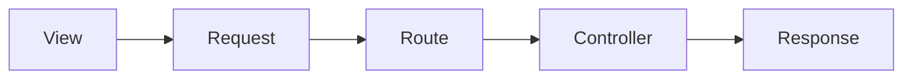

Pada dasar nya project ini dibuat dengan metode seperti berikut :



Maka untuk tracking modul, dapat dilakukan dengan memperhatikan hal-hal berikut :

## URI

Untuk mendapatkan **nama route**, bisa dengan mengecek endpoint URI dari halaman yang akan dicek.


Atau bisa juga Dengan mengecek **Network/Jaringan** untuk kasus request melalui javascript.


Atau jika terbiasa dengan **Laravel Debugbar** bisa dengan mengecek debugbar.


:::info
Jika ingin melakukan **pengecekan secara detail** yang lebih lengkap dan disertai performa, sebaiknya menggunakan **Laravel Debugbar**.
:::


## Routes

Setelah didapatkan URI-nya maka bisa langsung dicek ke folder project.


```php routes\web.php
<?php

use Illuminate\Support\Facades\Route;

// General
use App\Http\Controllers\General\GeneralController;
...

Route::middleware('auth')->group(function () {
    // General
    Route::controller(GeneralController::class)->prefix("general")->group(function () {
        // generate unlock token
        Route::post('/generate-unlock-token', 'generateUnlockToken')->name('generate-unlock-token');
        // get order
        Route::get('/get-order', 'getOrderInfo')->name('get-general-order');
        // get colors
        Route::get('/get-colors', 'getColorList')->name('get-general-colors');
        // get panels
        Route::get('/get-panels', 'getPanelList')->name('get-general-panels');
        // get sizes
        Route::get('/get-sizes', 'getSizeList')->name('get-general-sizes');
        // get count
        Route::get('/get-count', 'getCount')->name('get-general-count');
        // get number
        Route::get('/get-number', 'getNumber')->name('get-general-number');
        // get no form
        Route::get('/get-no-form-cut', 'getNoFormCut')->name('get-no-form-cut');
        // get group
        Route::get('/get-form-group', 'getFormGroup')->name('get-form-group');
        // get stocker
        Route::get('/get-form-stocker', 'getFormStocker')->name('get-form-stocker');

        // new general
        // get buyers
        Route::get('/get-buyers-new', 'getBuyers')->name('get-buyers');
        // get orders
        Route::get('/get-orders-new', 'getOrders')->name('get-orders');
        // get colors
        Route::get('/get-colors-new', 'getColors')->name('get-colors');
        // get sizes
        Route::get('/get-sizes-new', 'getSizes')->name('get-sizes');
        // get po
        Route::get('/get-pos', 'getPos')->name('get-pos');
        // get panels new
        Route::get('/get-panels-new', 'getPanelListNew')->name('get-panels');

        // General Tools
        Route::get('/general-tools', 'generalTools')->middleware('role:superadmin')->name('general-tools');
        Route::post('/update-master-sb-ws', 'updateMasterSbWs')->middleware('role:superadmin')->name('update-master-sb-ws');
        Route::post('/update-general-order', 'updateGeneralOrder')->middleware('role:superadmin')->name('update-general-order');

        Route::post('/get-general-order-color-from', 'getGeneralOrderColorFrom')->middleware('role:superadmin')->name('get-general-order-color-from');
        Route::post('/get-general-order-color-to', 'getGeneralOrderColorTo')->middleware('role:superadmin')->name('get-general-order-color-to');
        Route::post('/update-general-order-color', 'updateGeneralOrderColor')->middleware('role:superadmin')->name('update-general-order-color');

        // get scanned employee
        Route::get('/get-scanned-employee/{id?}', 'getScannedEmployee')->name('get-scanned-employee');

        // cutting items
        Route::get('/get-scanned-item/{id?}', 'getScannedItem')->name('get-scanned-form-cut-input');
        Route::get('/get-item', 'getItem')->name('get-item-form-cut-input');

        // output
        Route::get('/get-output', 'getOutput')->name('get-output');
        Route::post('/get-output-post', 'getOutput')->name('get-output-post');

        // master plan
        Route::get('/get-master-plan', 'getMasterPlan')->name('get-master-plan');
        Route::get('/get-master-plan-detail/{id?}', 'getMasterPlanDetail')->name('get-master-plan-detail');
        Route::get('/get-master-plan-output', 'getMasterPlanOutput')->name('get-master-plan-output');
        Route::get('/get-master-plan-output-size', 'getMasterPlanOutputSize')->name('get-master-plan-output-size');

        // reject in out
        Route::get('/get-reject-in', 'getRejectIn')->name('get-reject-in');
        // defect in out
        Route::get('/get-defect-in-out', 'getDefectInOut')->name('get-defect-in-out');

        // Part Item
        Route::get('/get-part-item', 'getPartItemList')->name('get-part-item');
    });
});
```