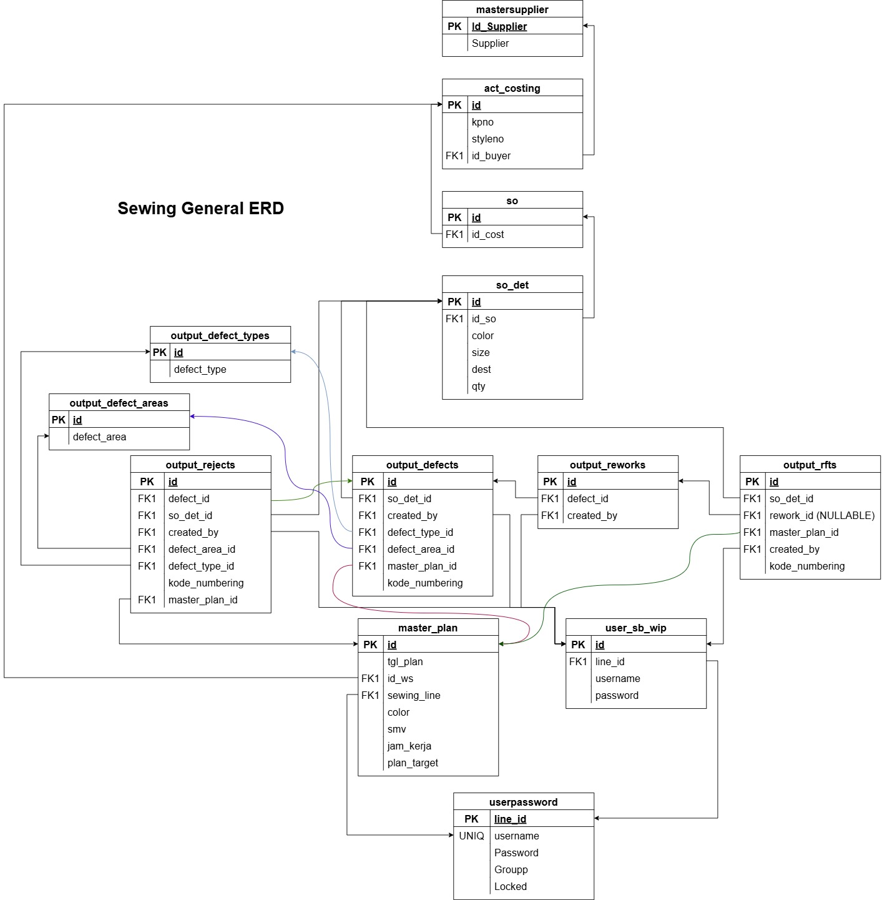

# Alur General

Project NDS ini memiliki alur yang dinamis, maka sebaiknya aplikasinya juga dibuat agar dapat dinamis/mudah diubah/mudah dirombak. Untuk gambaran umumnya bisa dilihat di link berikut : [Alur NDS Figma](https://www.figma.com/board/Tz4RO2HK0G6SgR9bZZJwSa/NDS?node-id=0-1&t=BvV1F13V3Tcf253r-1)

### Peta Produksi 

Untuk gambaran alur di lapangan, bisa dilihat di peta produksi berikut :

### Struktur Database

Struktur database di project ini masih berkembang. Tapi untuk gambaran umum bisa ditampilkan.

#### 1. NDS

Berikut struktur database dari NDS secara umum :

<a  href="../../static/assets/others/NDS-ERD.drawio" download>Download NDS ERD</a>

#### 2. Sewing

Untuk modul-modul di Sewing databasenya dipisahkan dari aplikasi NDS. Secara database menyatu dengan database master (signalbit). Berikut gambaran umumnya, tapi ini bukan versi terbarunya :

<a  href="../../static/assets/others/Sewing-Output-ERDiagram.drawio" download>Download Sewing ERD</a>

